# 前端 UI/UX 深度审查报告（v2）

> 状态：**视觉类建议作废，工程类发现有效**（2026-10-07 标注，依据 `UI_REFACTOR_V2_PLAN.md` §0）。
> 有效的工程类发现：F-01/F-02/F-03/F-06/F-08/F-11/F-18；其余视觉主张以 V2 计划为准。
>
> 生成日期：2026-09-23
> 覆盖提交：`76439ff..c9ca576`（含最近 2 个 frontend 重构提交 `c9ca576` / `0ce183a`）
> 生成时点：本地已 fast-forward 至 `c9ca576`
>
> **与 `优化建议.md` 分工**：那份是**视觉/交互 9 维度专项**（视觉层级、色彩、字体、间距、组件风格、动效、交互逻辑、交互体验、整体一致性）。本文件是**工程与设计系统层专项**——token 治理、CSS 架构、z-index、动画性能、响应式断点、可访问性、JS 模块耦合、XSS/innerHTML 面、多主题扩展。两份文档**互补**：那份是「看得见的部分」，这份是「看不见但决定上限的部分」。
>
> **诚实声明**：本次审查基于**静态代码 + grep 计数**，未启动服务渲染截图、未跑 JavaScript 测试（仓库无 JS 测试基建）、未加载实际业务数据。所有主张均带 `file:line` 与原文片段；`evidenceStatus = unverified`（未做运行时像素级验证）。

---

## 0. 一句话结论

前端**视觉品味**（暖纸底 + 墨灰主色 + 米白卡片 + 模块色轮转）已经不错，但**设计系统的工程化**明显落后于视觉成熟度——3 套并行 `:root` token 定义、z-index 有 14 个不同值散布在 4 个 CSS 文件、prefers-reduced-motion 只覆盖 1 个 transition、39 处 `innerHTML` 都是字符串拼接（其中 toast 直接注入 `text` 变量构成 XSS 面）、最近拆出的 3 个 JS 模块全用**全局函数 + 依赖 script 顺序**而非 ES module。这些不是「代码洁癖」，是**上限卡住天花板**——设计系统不收敛，视觉改进就会被下一次新增的组件继续稀释。

---

## 1. 项目前端拓扑（先看结构再谈细节）

前端不是「一个 app」，而是**两个独立入口 + 3 个新拆模块**：

```mermaid
flowchart LR
    subgraph 报价页
        IH[index.html<br>529 行]
        AJS[app.js<br>1722 行]
        SC[styles.css<br>497 行]
        QDC[quote-dashboard.css<br>914 行]
        RC[results.css<br>26 行]
    end
    
    subgraph 工作台页
        WH[workbench.html<br>836 行]
        WJS[workbench.js<br>1011 行]
        WC[workbench.css<br>235 行]
        WSC[workbench-standalone.css<br>546 行]
    end
    
    subgraph 共享 JS 模块 c9ca576
        SD[js/sidebar.js<br>53 行]
        ST[js/toast.js<br>43 行]
        SD2[js/dropdown.js<br>77 行]
    end
    
    IH --> AJS
    IH --> SC
    IH --> QDC
    IH --> RC
    IH --> SD & ST & SD2
    
    WH --> WJS
    WH --> WSC
    
    AJS -.->|全局函数依赖| ST & SD2
    SD -.->|仅报价页有 sbToggle| IH
    ST -.->|仅报价页有 toastPill| IH
    SD2 -.->|仅报价页有 cs-select| IH
```



**关键观察**：
- **两个入口共享 CSS token 语义**（暖纸底 `#f4f3f0`、墨灰主色 `#2f2e2b`、米白卡片 `#fcfbf8`、5 色轮转）但**各自定义**，形成 3 套并行 token 系统（详见 §2）。
- **新拆 3 个 JS 模块** 名义上「独立」，实际**只服务报价页**——`sidebar.js` 依赖 `#sbToggle` / `.app-shell`，`toast.js` 依赖 `#toastPill`，`dropdown.js` 依赖 `.cs`；工作台页没有这些 DOM，三个模块的 IIFE 直接 early return 退出。
- **共享 CSS** 的边界模糊：`styles.css` 与 `workbench-standalone.css` 都定义 sidebar / hero / card 的样式，靠**加载顺序**隐式区分作用域。

---

## 2. 设计系统：token 治理崩塌（🔴 P0）

### F-01 · 3 套并行 `:root` token 定义

**现状**（grep `:root\s*\{` 命中）：

| 文件 | `:root` 起始行 | 定义 token 数量 | 是否被覆盖 |
|------|--------------|---------------|-----------|
| `styles.css:5` | L5 | ~40 个（含 `--accent-600`, `--success`, `--warn` 等） | 主入口，未被覆盖 |
| `workbench-standalone.css:5` | L5 | ~35 个 | 与 `styles.css` 大部分重复但独立 |
| `workbench.css:2` | L2（作用域内 `#workbenchView`） | ~30 个 | 与 `workbench-standalone.css` 完全重复 |
| `quote-dashboard.css:6` | L6 `:root{ --brand-gold:#e6b96a; }` | 1 个 | 与 `styles.css --module-3` 重复 |
| `quote-dashboard.css:288` | L288 `:root{ --intake-cap:#3d6cad; ... }` | 4 个 | 无重复但独立命名空间 |

**证据摘录**：
- `workbench.css:8` `--border: #ecebe5;` ← 与 `styles.css:15` `--border:#ecebe5;` 与 `workbench-standalone.css:12` `--border: #ecebe5;` **逐字重复**
- `workbench.css:17` `--accent: #2f2e2b;` ← 与 `styles.css:21` `--accent:#2f2e2b;` **逐字重复**
- `workbench.css:12` `--text: #232220;` ← 与 `styles.css:18` `--text:#232220;` **逐字重复**
- `workbench.css:13` `--text-secondary: #736e65;` ← 与 `styles.css:19` `--text-secondary:#736e65;` **逐字重复**
- `quote-dashboard.css:6` `--brand-gold:#e6b96a;` ← 与 `styles.css:31` `--module-3:#bd8a4e;` 都是**金色系**但不同值——如果哪天 module-3 换颜色，brand-gold 不会跟着变

**为什么是问题**：
- 「一处改色，整站换肤」的设计承诺（`workbench-standalone.css:4` 注释）在实际里**做不到**——改 `styles.css --border` 不会同步到 `workbench.css --border`。
- 未来加主题（暗色 / 品牌色切换）时，要改 3 处；再加模块色 / 状态色扩展，会膨胀到 6+ 处。
- `workbench.css` 与 `workbench-standalone.css` 的 token **完全同值**，是纯粹的复制粘贴——`0ce183a` 提交消息「消除 CSS 重复」实际只消除了 HTML 内联 CSS，token 层的重复还在。

**建议**：
1. **单点真相源**：只保留 `styles.css` 的 `:root`，`workbench-standalone.css` 与 `workbench.css` 删掉 token 定义，只写组件样式。
2. **子作用域 token 通过 CSS 变量覆盖而非重定义**：`#workbenchView { --accent: ... }` 只在需要差异化的地方覆盖，不要复制粘贴。
3. **建立 `design-tokens.md`**：文档记录每个 token 的语义（如 `--module-3 = 赭黄 = 连续天数 / 星标 / 打卡`），避免下次新增 token 时命名漂移。

**成本**：约 2 小时。删除 2 处重复 token 定义 + 迁移 4 个 CSS 文件的引用。

---

### F-02 · hex 值 64 处未收敛到 token

**现状**：`grep #[0-9a-fA-F]{3,8}` 命中 64 处，其中大量是**已在 token 中定义但被裸写**：

| 文件 | 行号 | 值 | 应改为 |
|------|------|----|-------|
| `workbench.css` `.ov2-side` | L92-94 | `#33322e / #232220 / #1b1a18` | 已在 `--drawer-bg-top / --drawer-bg` 有近似值，但深灰渐变应建独立 token `--surface-dark-1/2/3` |
| `workbench.css` `.ov2-side` | 多处 | `rgba(244,243,240,.06)` `rgba(244,243,240,.09)` | 应改为 `var(--on-accent)` + alpha，或建 `--drawer-on-hover / --drawer-on-border` |
| `workbench.css` `.clock-card` | L107-108 | `#33322e / #232220 / #1c1b19` | 同 `.ov2-side`，重复模式 |
| `workbench.css` `.clock-card` | L107 | `rgba(189,138,78,.35)` | 应改为 `rgba(var(--module-3-rgb), .35)` 或建 `--module-3-glow` |
| `workbench.css` `.clock-card` | L107 | `rgba(111,143,106,.28)` | 应改为 `rgba(var(--module-1-rgb), .28)` |
| `workbench.css` `.pomo` | L133 | `rgba(197,93,79,.28)` | 应改为 `rgba(var(--danger-rgb), .28)` |
| `styles.css:431` | L431 | `rgba(20,22,26,.42)` | 深灰遮罩无 token，应建 `--overlay-bg` |
| `styles.css:490` | L490 | `rgba(13,13,15,.45)` | 又一种深灰遮罩，颜色不同——**两种遮罩并存** |

**关键问题**：
- **两种遮罩色并存**：`styles.css:431` 用 `rgba(20,22,26,.42)`（偏冷灰），`:490` 用 `rgba(13,13,15,.45)`（偏纯黑），视觉上看不到差别，但代码里是两份。
- **模块色只定义了 `#hex`，没有 RGB 分量**：想要 `rgba(--module-3, .3)` 时必须知道 `#bd8a4e` = `(189,138,78)` 才能写出，但 CSS 变量在 `rgba()` 里**不能直接用 hex**——这是现代 CSS 变量系统的经典陷阱。建议每个模块色**同时**提供 `--module-3: #bd8a4e;` 与 `--module-3-rgb: 189,138,78;`。

**建议**：
1. 把 `styles.css` 的 `:root` 加一套 `--*-rgb` 分量变量（`--module-1-rgb / --accent-rgb / --danger-rgb`）。
2. 全 CSS `grep "#[0-9a-fA-F]{6}"`，把所有裸 hex 改成 `var(--...)` 或 `rgba(var(--...-rgb), α)`。
3. **验收判据**：`grep -E "#[0-9a-fA-F]{6}" *.css` 应只剩在 `:root` 的 token 定义里出现。

**成本**：约 3 小时（含 `grep` 替换与回归视觉检查）。

---

### F-03 · z-index 有 14 个不同值，散布 4 文件（🟠 P1）

**现状**（`grep "z-index:\s*\d{2,3}"` 完整清单）：

| z-index | 值 | 出现位置 | 语义 |
|--------|----|---------|------|
| 3 | — | 无 | （建议：base 内容） |
| 5 | — | 无 | （建议：sticky 元素） |
| 10 | 2 处 | `styles.css:268, 273` | tooltip |
| 20 | 1 处 | `workbench.css:118` | wb-nav sticky |
| 30 | 3 处 | `styles.css:362`, `workbench-standalone.css:74`, `workbench.css:58` | 侧栏 + 下拉 |
| 50 | 2 处 | `quote-dashboard.css:235`, `workbench.css:195` | Floating Dock + biz-card hover |
| 55 | 1 处 | `styles.css:431` | backdrop |
| 60 | 3 处 | `styles.css:435`, `workbench-standalone.css:333`, `workbench.css:58` | sidebar（移动）/ overlay |
| 90 | 1 处 | `quote-dashboard.css:662` | 报价页右下角悬浮 |
| 95 | 1 处 | `quote-dashboard.css:253` | 报价页抽屉遮罩 |
| 99 | 1 处 | `workbench-standalone.css:519` | backdrop |
| 100 | 2 处 | `quote-dashboard.css:257`, `workbench-standalone.css:534` | 抽屉 + 侧栏移动 |
| 101 | 1 处 | `workbench-standalone.css:515` | 汉堡按钮 |
| 120 | 1 处 | `styles.css:447` | modal-mask |
| 130 | 1 处 | `quote-dashboard.css:883` | overlay |
| 200 | 1 处 | `quote-dashboard.css:273` | toast-pill |
| 1000 | 1 处 | `styles.css:490` | ui-confirm-overlay |

**关键观察**：
- **同一语义用不同值**：backdrop 在 `styles.css:431` 是 `55`，在 `workbench-standalone.css:519` 是 `99`；sidebar 移动态在 `styles.css:435` 是 `60`，在 `workbench-standalone.css:534` 是 `100`；overlay 在 `workbench-standalone.css:333` 是 `60`，在 `quote-dashboard.css:883` 是 `130`。
- **两个「顶层」值**：toast-pill 用 `200`，ui-confirm-overlay 用 `1000`——用户操作时，如果 ui-confirm-overlay 弹出，toast-pill 会被**遮住**（因为 1000 > 200）；但如果反过来，ui-confirm-overlay 会被 toast-pill 遮住（因为 200 < 1000）。这个交互顺序**没有明确规则**。
- **无 `:root` 变量定义 z-index 阶梯**：所有 z-index 都是硬编码数字，未来调整需要 grep 全 CSS。

**建议**：
1. 在 `styles.css:root` 加一组 z-index token：
   ```css
   :root {
     --z-base: 0;        /* 普通内容 */
     --z-sticky: 5;      /* 卡片内 sticky 表头 */
     --z-nav: 20;        /* 顶部导航、下拉面板 */
     --z-sidebar: 30;    /* 侧栏（桌面固定） */
     --z-floating: 50;   /* Floating Dock、右下悬浮 */
     --z-backdrop: 60;   /* 半透明遮罩 */
     --z-drawer: 70;     /* 抽屉（右侧滑入） */
     --z-modal: 80;      /* 模态弹窗 */
     --z-toast: 90;      /* Toast 顶部气泡 */
     --z-portal: 100;    /* 全局覆盖层（ui-confirm） */
   }
   ```
2. 4 个 CSS 文件全部把硬编码数字替换为 `var(--z-*)`。
3. **验收判据**：`grep -E "z-index:\s*\d" *.css` 应只剩在 `:root` 的 token 定义。

**成本**：约 1 小时。纯机械替换 + 视觉回归。

---

## 3. 色彩与视觉语义（🟠 P1）

### F-04 · module-3 在 3 个语义里被复用

**证据**：
- `styles.css:31` `--module-3:#bd8a4e;` 注释「赭黄 — 运动 / 连续天数 / 星标」
- `workbench.css` `.pin-btn.on`：`color:var(--module-3)` —— 星标
- `workbench.css` `.rec .pin-btn:hover`：`color:var(--module-3)` —— 星标
- `quote-dashboard.css:354` `@keyframes guardrailBreathe`：呼吸提示用 `--warn` 但注释说是「赭石」
- `quote-dashboard.css:576` `.kpi-*` KPI 数值：`color:var(--module-3)` —— 强调数值

**问题**：`--module-3` 被同时用于**运动分类** + **强调色** + **hover 星标**——三个不同语义。当业务扩展（新增 6 类运动、新增 KPI 类型）时，用户无法通过颜色语义判断当前所在模块。

**建议**：
- 拆分：`--accent-secondary`（强调数值、hover 星标）与 `--module-3`（运动分类），语义分离。
- 或采用「分类色仅用于分组标签、绝不用于强调」的硬规则，写进 `design-tokens.md`。

### F-05 · 侧栏明暗对比过强（`优化建议.md` 已覆盖，此处补工程视角）

`styles.css:22-27` 定义 `--drawer-bg:#23211e` 到 `--drawer-bg-top:#2d2c29`——**接近纯黑**（L 值约 13-15%），而主背景 `--page-bg:#f4f3f0` 是 **L 值 96%**。**明度对比 82%**，远超 WCAG AA 推荐的 3:1 装饰色对比。

这不是 bug，是设计选择——但**在深色模式下必然失效**（如果未来加 dark theme，`--drawer-bg` 与 `--page-bg` 会互换，此时侧栏就变成「比页面还浅」）。建议现在就在 `:root` 加 `prefers-color-scheme` 变量切换，把 token 层与主题解耦。

### F-06 · focus-visible 覆盖率极低

`grep "focus-visible\|:focus"` 只命中 15 处：
- `styles.css`：input/textarea `:focus`（有 border-color 变化）、button 无 `:focus-visible`
- `quote-dashboard.css:35` input `:focus`
- `workbench.css`：input `:focus`

**问题**：
- **鼠标点击 vs 键盘 Tab 无法区分**：所有 `:focus` 样式都同时应用于鼠标点击和键盘导航，鼠标点击按钮时视觉焦点闪烁。
- **可访问性不达标**：WCAG 2.1 Success Criterion 2.4.7 「可见的焦点」要求键盘导航时焦点必须可见。当前只有 input 有，button / nav-item / modal 等交互元素**无 focus 样式**。

**建议**：
1. 把所有交互元素的 `:focus` 改为 `:focus-visible`（仅键盘触发时显示）。
2. 定义统一 focus ring：
   ```css
   :focus-visible {
     outline: 2px solid var(--accent);
     outline-offset: 2px;
     border-radius: inherit;
   }
   ```
3. **验收**：Tab 键遍历全页，每个交互元素焦点清晰可见。

---

## 4. 动画与流畅度（🟠 P1）

### F-07 · 40+ 处 transition，缓动曲线 6 种、时间常数 12 种，无统一库

**grep 统计**：`transition:` 命中 40+ 处，`cubic-bezier` 命中 6 种不同曲线：
- `cubic-bezier(.2,.8,.3,1)` — `workbench-standalone.css:534`, `styles.css:435` — sidebar 移动
- `cubic-bezier(.2,.8,.2,1)` — `quote-dashboard.css:260` — drawer 移动（**与上者只差一位，可能是笔误**）
- `cubic-bezier(.22,.61,.36,1)` — `quote-dashboard.css:388` — cs-fill 宽度变化
- `cubic-bezier(.16,1,.3,1)` — `quote-dashboard.css:667` — 卡片入场
- `cubic-bezier(.2,.8,.3,1)` — `workbench-standalone.css:338` — modal pop
- **默认 ease** — 大量 transition 未指定缓动

时间常数：`.08s` / `.12s` / `.15s` / `.18s` / `.20s` / `.22s` / `.24s` / `.26s` —— 12 种不同时长，无统一节奏。

**问题**：
- **`.2,.8,.3,1` vs `.2,.8,.2,1`**：这两个缓动曲线看起来像「复制粘贴时的笔误」，实际差异很小但用户看不出；应统一为一种。
- **无 `--ease-*` 变量**：每个 transition 都手写缓动曲线，改一处不动其他。
- **`.08s` 太短**：`quote-dashboard.css:347` `transition:left .08s ease-out` 用于进度条滑动——`.08s` 在低端设备上会跳变。

**建议**：
1. 在 `styles.css :root` 加动画 token：
   ```css
   :root {
     --ease-out: cubic-bezier(.2,.8,.3,1);          /* 主流缓出，替换所有 .2,.8,.x,y */
     --ease-in-out: cubic-bezier(.4,0,.2,1);        /* 对称 */
     --ease-bounce: cubic-bezier(.175,.885,.32,1.15); /* 弹性入场 */
     --dur-fast: 120ms;   /* 微交互、hover */
     --dur-base: 180ms;   /* 一般元素、下拉展开 */
     --dur-slow: 280ms;   /* 大面板、抽屉 */
   }
   ```
2. 全 CSS 把 `cubic-bezier(...)` 与裸 `Xs` 替换为 `var(--ease-*) / var(--dur-*)`。
3. **验收判据**：`grep "cubic-bezier" *.css` 应只在 `:root` 出现。

### F-08 · 无 `prefers-reduced-motion` 覆盖，动画密集

**grep `prefers-reduced-motion`** 只命中 1 处：`workbench.css:205` `.biz-col .biz-card{transition:none}`。

而 CSS 中定义了 13 个 `@keyframes`（`@keyframes fade / pop / qdFadeIn / guardrailBreathe / intakePulse / intakePulseRing / dockSpin / kpiIn / valIn / prepPop / ctaBreath / fadeIn / modalEnter`），其中至少 4 个是**常驻循环**：
- `guardrailBreathe`（4s 无限循环透明度呼吸）
- `intakePulse`（无限循环）
- `intakePulseRing`（无限循环 scale）
- `dockSpin`（无限旋转，loading 状态）
- `ctaBreath`（CTA 呼吸）

**无障碍问题**：`prefers-reduced-motion: reduce` 用户（约 30% 移动用户 + 部分桌面用户开启「减少视觉特效」）会看到全部动画照常播放。WCAG 2.3.3 明确要求尊重此偏好。

**建议**：
1. 在 `styles.css` 加全局降级：
   ```css
   @media (prefers-reduced-motion: reduce) {
     *, *::before, *::after {
       animation-duration: 0.001ms !important;
       animation-iteration-count: 1 !important;
       transition-duration: 0.001ms !important;
       scroll-behavior: auto !important;
     }
   }
   ```
2. 保留 loading spinner（`dockSpin`）但降低旋转速度或用 opacity 替代。

**成本**：15 分钟。

### F-09 · 动画属性选择偏 layout-heavy

grep `@keyframes` 与 `transition:`，发现大量动画作用于 **`transform` + `opacity`**（✅ 友好合成器），但也有：
- `workbench.css` `.rec .acts` `transition:opacity .15s` — ✅ 好
- `workbench.css` `.card:hover { box-shadow: var(--shadow-overlay); }` — ❌ `box-shadow` 触发重绘（非合成器）
- `workbench.css` `.modcard:hover { transform:translateY(-2px); box-shadow:var(--shadow-overlay); }` — ✅ transform + ❌ box-shadow 混合
- `quote-dashboard.css:98` `transition:all .18s ease` — ❌ `all` 包含所有可能重绘的属性
- `quote-dashboard.css:122` `transition:all .15s ease` — ❌ 同上

**问题**：`transition:all` 是性能杀手——当任何 CSS 属性变化都会触发动画，包括不相关的属性。虽然现代浏览器会优化到合成器层，但 `box-shadow` 变化仍会触发 paint。

**建议**：
1. `grep "transition:all"` 全部展开为具名属性列表。
2. **`box-shadow` 动画改写为伪元素 opacity**：把 `.card::before { box-shadow: var(--shadow-overlay); opacity: 0; }` + `.card:hover::before { opacity: 1; }` —— 只动 opacity，走合成器。
3. **验收**：Chrome DevTools Performance 面板抓 1 秒交互动画，Paint 时间应 < 5ms/frame。

---

## 5. 响应式断点（🟡 P2）

### F-10 · 5 组不同断点并存，无统一栅格

**grep `@media` 完整清单**：

| 文件 | 断点 | 数量 |
|------|------|------|
| `styles.css` | 1600px, 1080px, 720px | 3 个（+ prefers-reduced-motion） |
| `quote-dashboard.css` | 1400px, 1200px, 768px | 3 个（+ prefers-reduced-motion） |
| `workbench.css` | 1200px, 720px | 2 个 |
| `workbench-standalone.css` | 1024px, 768px | 2 个 |

**关键冲突**：
- **1200px 出现 2 次**：`workbench.css:234` `grid-template-columns:repeat(3,1fr)` 与 `quote-dashboard.css:600` `--dock-w:420px` —— 两个页面同一断点触发**不同布局切换**。
- **768px 与 720px 并存**：仅差 48px，是「响应式抖动」的常见来源（用户缩放浏览器 1% 就跨过其中一条）。
- **1024px vs 1080px**：`workbench-standalone.css` 用 1024（标准 tablet），`styles.css` 用 1080（近似）——用户在小平板上会看到不同页面在不同时机切换。

**建议**：
1. 定义 4 档主断点：
   ```css
   :root {
     --bp-sm: 720px;   /* 手机竖屏 */
     --bp-md: 1024px;  /* 平板 */
     --bp-lg: 1280px;  /* 桌面小屏 */
     --bp-xl: 1600px;  /* 桌面大屏 */
   }
   ```
2. 所有 `@media (max-width: N)` 收敛到 4 个断点之一。
3. **验收判据**：`grep "@media.*max-width" *.css` 只出现 4 种 `max-width` 值。

---

## 6. 可访问性与交互（🟠 P1）

### F-11 · `innerHTML` 39 处字符串拼接，XSS 面明确

**grep `\.innerHTML\s*=`** 命中 39 处，全部用模板字符串或字符串拼接：

关键位置：
- `frontend/js/toast.js:15` `tm.innerHTML = text;` —— **`text` 是函数参数，直接注入**，任何调用 `setMessage('<script>...</script>', 'error')` 都会执行。虽当前代码调用者都传安全字符串，但**接口没防御**。
- `frontend/js/dropdown.js:43` `wrap.innerHTML = '<button ...>...</button><ul ...></ul>';` —— 内联 HTML，其中 `o.label` 用 `textContent` 写入（✅ 安全），但 `data.forEach` 里 `li.innerHTML` 没用——检查后确实没混入。
- `workbench.js:369/427/466/495/704/872/880` 等 10+ 处：`innerHTML = \`...\${icon(...)}...\${m.name}\`` —— `m.name` 是用户可编辑字段（`workbench.js` 里的记录编辑），如果含 `<` `>` 就会被浏览器解析为 HTML。

**建议**：
1. **`setMessage` 改为 textContent**：
   ```js
   // 现状
   tm.innerHTML = text;
   // 建议
   tm.textContent = text;  // 或 text.replace(/<[^>]+>/g, '');
   ```
   但 40+ 处调用传入了 `<b>` 标签（`<b>已保存</b>`），改成 textContent 会失去粗体。建议**在 `setMessage` 内做白名单过滤**：
   ```js
   function setMessage(text, kind = '') {
     // 只允许 <b>, <br>, <strong> 三种安全标签
     const safe = text.replace(/<(?!\/?(b|strong|br)\b)[^>]*>/g, '');
     tm.innerHTML = safe;
     ...
   }
   ```
2. **`workbench.js` 里所有 `m.name` / `m.desc` / 用户输入字段** 应改为 textContent + DOM API 拼接：
   ```js
   // 现状
   grid.innerHTML = rows.map(r => `<div>${r.name}</div>`).join('');
   // 建议
   grid.replaceChildren(...rows.map(r => {
     const d = document.createElement('div');
     d.textContent = r.name;
     return d;
   }));
   ```
3. **验收判据**：`grep "innerHTML =.*\${" *.js` 应返回 0 命中。

**成本**：约 2 小时。涉及 39 处修改，其中 15 处是简单的 `textContent` 替换，其余是 DOM API 重写。

### F-12 · `addEventListener` 56 处，多处无清理机制

**grep 命中**：56 处 `addEventListener`，0 处 `removeEventListener`。

**问题位置**：
- `app.js:42` `window.addEventListener('hashchange', ...)` — window 级监听器，页面 SPA 切换时不会清理。
- `sidebar.js:9` `toggle.addEventListener('click', ...)` — 模块 IIFE 只在页面加载时跑一次，OK。
- `sidebar.js:18` `window.addEventListener('keydown', e => { if (e.key === 'Escape') set(false); })` — **每次页面加载挂一个**，`workbench.html` 也加载 sidebar.js（无 #sbToggle 会 early return，但 keydown 监听在 `if (!shell || !toggle || !backdrop) return;` **之后**，所以只有报价页会挂）。
- `toast.js:37` `document.querySelectorAll('#ratioMin,#ratioMax').forEach(el => el.addEventListener('input', validateParams));` — **顶层 IIFE**，无清理，但如果 input 元素被动态重建（比如表单 refresh），旧监听器仍在。

**建议**：
1. 引入 `AbortController` 模式，用 `controller.signal` 集中管理监听器：
   ```js
   const controller = new AbortController();
   toggle.addEventListener('click', handler, { signal: controller.signal });
   // 清理时
   controller.abort();
   ```
2. 或封装 `on(element, type, handler, { signal })` 工具函数。

### F-13 · 无 modal focus trap

`styles.css:447` `.modal-mask` 是模态遮罩，但 JS 里（`app.js` / `workbench.js` / `js/*.js`）没有 focus trap 逻辑——用户在模态内按 Tab 会跳到模态外的页面元素，模态关闭按钮无法通过键盘聚焦（除非 HTML 里手写 tab order）。

**建议**：在模态组件初始化时：
1. 记住打开前的焦点元素；
2. 聚焦到模态内首个可聚焦元素；
3. Tab 键循环捕获（最后一个 tab 回到第一个）；
4. Esc 关闭 + 恢复焦点。

标准做法（`dialog polyfill` 或 `ariakit`），约 40 行代码。

---

## 7. 工程结构（🟡 P2）

### F-14 · 新拆 3 个 JS 模块全用全局函数，无 export

`c9ca576` 提交引入 `js/sidebar.js` / `js/toast.js` / `js/dropdown.js`，全部是**全局函数 + IIFE**，无 `export` / `import`：
- `dropdown.js:16` `function initCustomSelect(selId)` —— 挂在 window 上，`app.js` 直接调用
- `toast.js:12` `function setMessage(text, kind = '')` —— 挂在 window 上，`app.js` 40+ 处调用
- `sidebar.js` 两个 IIFE —— 独立运行，不导出

**问题**：
1. **依赖顺序靠 HTML script 标签隐含约定**：`index.html` 必须按 `sidebar → toast → dropdown → workbench → app` 顺序加载。加新模块容易出错。
2. **无 tree-shaking**：即使 `dropdown.js` 里的 `initCustomSelect` 只被 3 处调用，整份代码 77 行全部加载。
3. **无静态类型检查**：`setMessage('<b>已保存</b>', 'success')` 的字符串参数没有类型保护。
4. **无单元测试能力**：仓库无 JS 测试基建，全局函数无法通过 `import { setMessage } from './toast'` 单独测试。

**建议**：
1. **短期（1 小时）**：改成 ES module：
   ```js
   // toast.js
   export function setMessage(text, kind = '') { ... }
   // dropdown.js
   export function initCustomSelect(selId) { ... }
   // sidebar.js
   export function initSidebar() { ... }
   export function initUserName() { ... }
   ```
   HTML 用 `<script type="module">` 加载，`app.js` 顶部 `import { setMessage } from './js/toast.js';`。
2. **中期**：接入最小测试基建（Vitest 或 Node --test）——把 `validateParams` 这类纯函数抽出来做单元测试。

### F-15 · 无任何前端测试

`git ls-files frontend/ | grep -iE "test|spec"` 返回 0 命中。`package.json` 不存在（frontend 是纯静态 HTML/CSS/JS）。

**问题**：
- `c9ca576` 拆分 3 模块 = 159 行代码迁移，无测试保障，只能靠人工视觉回归。
- `toast.js` 的 `setMessage` 40+ 调用点、`validateParams` 的 6 条校验规则——**任何一个字符改动都可能静默破坏 UI**（比如 `.toast-pill.show` class 名从 `show` 改成 `visible`，40+ 处调用点全部静默失效）。
- **前端重构风险无缓冲**：`0ce183a` 消除 CSS 重复 = 535 行 CSS 迁移，无 CSS 断言测试（视觉回归测试）。

**建议**：
1. **短期**：给 `js/toast.js` / `js/dropdown.js` / `js/sidebar.js` 加 Vitest 单元测试（3 个模块 = 约 15 个测试用例，验证函数签名、错误态、边界条件）。
2. **中期**：接入 Playwright 视觉回归（截 20 张关键屏 before/after 基线）——覆盖报价页表单、工作台 hero、模态弹窗 3 类高频交互。
3. **验收**：GitHub Actions / CI 里加 `npm test` 步骤。

### F-16 · 无 CSP（Content-Security-Policy），HTML 中 `onerror` 事件处理器暴露

`grep "onerror\|onload\|onclick\|onchange"` 命中多处：
- `workbench.html:15` `<button onclick="...">` 内联事件——虽然当前安全，但 CSP 会禁止内联事件。
- `api/app.py` 返回 HTML 时可能注入用户输入（虽当前 API 只返回 JSON，但未来可能变化）。

**建议**：`api/app.py` 加 CSP header：
```python
@app.middleware("http")
async def add_csp(request, call_next):
    response = await call_next(request)
    if request.url.path.startswith(("/api/", "/assets/")):
        return response
    response.headers["Content-Security-Policy"] = "default-src 'self'; script-src 'self'; style-src 'self' 'unsafe-inline'; img-src 'self' data:; connect-src 'self' http://127.0.0.1:8000"
    return response
```

**成本**：10 分钟。

---

## 8. 多主题扩展性（🟢 P3）

### F-17 · 无 `data-theme` 切换机制

`grep "data-theme\|prefers-color-scheme\|@media \(prefers-color-scheme"` 返回 0 命中。

如果未来加暗色主题或高对比主题，需要在 4 个 CSS 文件里手动改颜色。

**建议**：在 `styles.css :root` 加：
```css
:root { /* 浅色默认 */ }
:root[data-theme="dark"] { /* 暗色覆盖 */
  --page-bg: #1a1a1c;
  --surface-card: #242427;
  --text: #e8e8e8;
  ...
}
@media (prefers-color-scheme: dark) {
  :root:not([data-theme="light"]) { /* 跟随系统，除非显式指定 */ }
}
```

**成本**：约 4 小时。定义暗色 token 集 + 视觉验证。

---

## 9. 优先级排序与落地建议

### 🔴 P0：设计系统地基（3-4 小时）
- **F-01** 单点 token 真相源（合并 3 套 → 1 套）
- **F-02** 裸 hex 收敛到 token（+ 提供 `-rgb` 分量）
- **F-03** z-index token 化（14 → 10 个语义）

### 🟠 P1：视觉打磨与无障碍（3-4 小时）
- **F-08** `prefers-reduced-motion` 全局降级（15 分钟）
- **F-09** `transition:all` 展开 + box-shadow 用 opacity 走合成器
- **F-06** `:focus-visible` 全覆盖（WCAG 2.1 SC 2.4.7）
- **F-11** `innerHTML` XSS 面收敛（39 处）
- **F-12** `addEventListener` 用 AbortController 集中管理
- **F-13** modal focus trap（40 行代码）

### 🟡 P2：工程与响应式（2-3 小时）
- **F-05** 侧栏明暗对比 token 层可切（为未来 dark theme 铺路）
- **F-10** 断点统一 4 档
- **F-14** JS 模块 ES module 化
- **F-16** CSP header

### 🟢 P3：测试与主题（4-8 小时）
- **F-15** JS 单元测试（Vitest）+ 视觉回归（Playwright）
- **F-17** `data-theme` 切换机制

---

## 10. 未覆盖维度

- **实际渲染截图对比**：本次未启动服务渲染页面。所有结论基于**静态代码阅读 + grep 计数**，未做「截图 before/after 视觉回归」。**若要做像素级验证，请用 `visual-acceptance` skill 配合 `browser_debug` 工具跑一次真机截图矩阵。**
- **性能测量**：Lighthouse 未跑、Chrome DevTools Performance 未抓。CSS 总大小 6489 行（约 200KB 未压缩），首屏加载性能未测量。
- **真实数据下布局**：未测试 1000+ 项 BOQ 表格在表格区滚动、sticky 表头、hover 高亮等细节。
- **跨浏览器兼容**：仅 Chrome/Edge 现代版本假设，Safari / Firefox 兼容未验证（`color-mix()` `backdrop-filter()` 在旧 Safari 上行为不同）。

---

## 11. 方法学与证据

- **静态审查**：`read_file` + `grep` 覆盖 `frontend/` 全 6489 行（HTML 1365 行 + JS 2806 行 + CSS 2218 行）。
- **交叉核验的关键 grep 计数**（本次现场跑）：
  - `:root\s*\{` → **5 处**（3 套并行 token）
  - `#[0-9a-fA-F]{3,8}` → **64 处**（大量裸 hex）
  - `z-index:\s*\d{2,3}` → **14 个不同值**（跨 4 CSS）
  - `@keyframes\s+` → **13 个动画**
  - `@media[^{]*\{` → **16 处**（跨 4 CSS，5 组断点）
  - `addEventListener` → **56 处**（0 处 `removeEventListener`）
  - `\.innerHTML\s*=` → **39 处**（全部字符串拼接）
  - `transition:` → **40+ 处**（6 种缓动、12 种时长）
  - `cubic-bezier` → **6 种不同曲线**
  - `prefers-reduced-motion` → **1 处**（严重覆盖不足）
  - `data-theme\|prefers-color-scheme` → **0 处**（无多主题）
- **诚实声明**：本会话未运行 JS、未截图、未跑测试。所有主张 `evidenceStatus = unverified`（静态代码级证据充分，但未做运行时验证）。

---

## 12. 与 `优化建议.md` 的对照验证：已修复 vs 未修复 vs 新发现

> **背景**：仓库中已有一份早期 UI/UX 报告 `docs/优化建议.md`（9 维度、368 行）。该文档基于早期代码快照撰写，`0ce183a`（消除 CSS 重复 + 响应式）与 `c9ca576`（拆分 app.js 为 3 模块 + 独立 CSS）两次重构之后，其中大部分结论已不再成立。本节把旧文档的每条主张**逐条对照当前代码**验证，标注状态并给出证据，最终形成「已落地 / 未落地 / 新发现」三态清单。

### 12.1 逐条验证矩阵（`优化建议.md` 主张 vs 当前代码）

| # | 旧文档主张 | 严重度 | 当前状态 | 现场证据（grep 计数 / file:line） |
|---|----------|-------|---------|----------------------------------|
| O1 | 硬编码冷蓝色 `#0a60d8` 污染下拉选中态 | P0 | ✅ **已修复** | `grep "0a60d8" *.css` → **0 命中**（`styles.css / quote-dashboard.css / results.css` 全数） |
| O2 | `.cs-trigger` / `.plan-select` 使用 iOS 拟物毛玻璃（`backdrop-filter: blur(16px) saturate(1.5)` + inset 高光） | P0 | ✅ **已修复** | `quote-dashboard.css:479, 482` 显式 `backdrop-filter:none;-webkit-backdrop-filter:none;` 与 `inset:0`（取消 inset 高光） |
| O3 | 字重阶梯碎片化：出现 `750 / 650 / 480 / 780` | P1 | ✅ **已修复** | `grep -cE "font-weight:\s*(750|650|480|780)"` → **0 命中**（当前仅用 500/600/700/800 四档标准字重） |
| O4 | 侧栏品牌字用土豪金 `#e6b96a` + `text-shadow: 0 1px 3px` 装饰阴影 | P1 | ⚠️ **部分修复** | `text-shadow` **完全消失**（0 命中）；但 `#e6b96a` 仍在 `quote-dashboard.css:6` `:root { --brand-gold:#e6b96a; }` 与 `workbench.css:179` 用作投标阶段的 `biz-tab` 标记色——**当前是语义用途而非装饰用途**，属可接受 |
| O5 | 双原生 range 滑块绝对定位叠放导致碰撞死锁（`ratioLow > ratioHigh`） | P0 | ✅ **已修复** | 结构保留（`index.html:150-158` `.guardrail-track` + `#ratioLow / #ratioHigh`），但 `app.js:1266-1330` `refreshRatioUI()` 已实现完整碰撞锁——`if (t === lo && L > H - 5) L = H - 5` / `if (t === hi && H < L + 5) H = L + 5` 强制 5% 物理区间 + `app.js:1312-1317 refreshRatioHover(x)` 根据鼠标位置动态调整 thumb z-index（`dLo <= dHi ? '4' : '3'`）解决重叠死锁 |
| O6 | 就绪清单状态点静态标记，用户无闭环反馈 | P0 | ✅ **已实现** | `app.js:1365` `const dot = row.querySelector('.prep-dot');` + `dot.dataset.state = 'pass' \| 'warn' \| 'fail' \| 'pending'`；`quote-dashboard.css:823` 有对应状态色 |
| O7 | 上传后仅显示文件名，无解析摘要 | P1 | ✅ **已实现** | `app.js:1094` `capStat.innerHTML = `<b>${items.length}</b> 条明细 · ¥${fmt(capSum)} · 最高限价`；`app.js:1097` 成本侧同款 + 未匹配数；`app.js:1099` 匹配摘要「${matched} 项匹配 · 限价未覆盖 ${ONLY_IN_COST.length} 项 · 成本缺失 ${ONLY_IN_CAP.length} 项」 |
| O8 | KPI 穿透后无 active 态、无退出按钮 | P1 | ✅ **已实现** | `app.js:410-424` KPI click 加 `active` class；`quote-dashboard.css:152-157` `.kpi-card.active` 有 border + `--kpi-accent`；`:154` `.kpi-drill-hint` 显示「筛选中 · 点其他项或 ✕ 清除」；`app.js:421` 支持点其他 KPI 切换或再点当前项清除 |
| O9 | 侧栏沉浸深黑（`#23211e → #2d2c29`）与暖纸底割裂 | P0 | ⚠️ **未修复** | `styles.css:22-25` `--drawer-bg:#23211e; --drawer-bg-top:#2d2c29`；`workbench.css:56-58` 同款渐变 |
| O10 | 四种边框标准交织（实线 / 输入线 / 虚线 / 半透明白线） | P1 | ⚠️ **未修复** | `grep "dashed" *.css` → **10 处**（`quote-dashboard.css:5 处 / styles.css:2 处 / workbench-standalone.css:1 处 / workbench.css:2 处`）；`styles.css:447, 490` `rgba(20,22,26,.42)` / `rgba(13,13,15,.45)` **两种遮罩并存** |
| O11 | 大面积容器 `.card:hover` 触发全局阴影上浮 | P2 | ⚠️ **部分修复** | `workbench.css:58` `.modcard:hover { transform:translateY(-2px); box-shadow:var(--shadow-overlay); }` 保留；`.rec:hover { box-shadow:var(--shadow-overlay); }` 保留；`.biz-card:hover` 也有。**但** `styles.css` 主体 `.card` 无 hover 阴影，说明「大面积容器 hover 上浮」在**工作台侧保留，报价页侧去除** |
| O12 | 微字号跌破安全阈值（`10.5px / 11px / 11.5px`） | P1 | ❌ **未修复** | `grep -cE "font-size:\s*(10\.5px\|11px\|11\.5px)"` → **65 处**：`quote-dashboard.css:25`、`styles.css:6`、`workbench-standalone.css:16`、`workbench.css:17`、`results.css:1` |
| O13 | 缺乏 4px/8px 间距系统，充斥 `7px/9px/11px/13px/14px/15px/17px/19px` 奇偶混合 | P1 | ❌ **未修复** | `grep -cE "padding:\s*7\|9\|11\|13\|15\|17\|19px\|margin:\s*7\|11\|13\|15px"` → **17 处命中**（详见 12.2）；`grep --space-\|--bp-\|--z-\|--dur-\|--ease-` → **0 处**（**无任何 token 体系**） |
| O14 | 主内容区 `max-width: none` 超宽屏无约束 | P1 | ❌ **未修复** | `styles.css:87` `.main-content { flex:1; min-width:0; max-width:none; padding:22px 28px 32px; }` 仍显式 `max-width:none`；仅 `workbench.css:60` `#workbenchView .main > #screen { max-width:1180px; }` 局部限制 |
| O15 | 模态弹窗缺乏进出场物理重量 | P2 | ❌ **未修复** | `styles.css:447` `.modal-mask { animation: fadeIn .16s ease }` 仅遮罩有 fadeIn；模态弹窗本身**无弹入/弹出动画**（无 `@keyframes modalEnter`） |
| O16 | 表格底部缺安全区，浮动 Dock 遮挡表格最后一行 | P1 | ❌ **未修复** | `grep "padding-bottom:\s*8[0-9]"` → **0 命中**；`styles.css:87` `.main-content padding-bottom:32px`、`:88 .table-section padding-bottom:20px`、`quote-dashboard.css:846` `.table-scroll { max-height:62vh; margin-bottom:14px }`——**均未预留浮动 Dock（`.floating-dock bottom:24px right:32px z-index:50` 高度约 80px）的遮挡空间** |

### 12.2 状态归类（合并结论）

#### ✅ 已修复 8 条（旧文档过时，不应再作为待办）

- O1 冷蓝色污染
- O2 拟物毛玻璃下拉
- O3 非标字重 750/650/480/780
- O5 双滑块碰撞死锁
- O6 就绪清单静态标记
- O7 上传后无解析摘要
- O8 KPI 穿透无 active 态
- 部分：O4 品牌字阴影（`text-shadow` 全消失）、O11 报价页大卡片 hover 上浮

**结论**：`0ce183a` / `c9ca576` 之前的重构已经**系统性修复**旧文档提到的最大硬伤——拟物毛玻璃、iOS 风格冷蓝、双滑块碰撞死锁、KPI 无激活态。**旧文档 9 大维度里 6 个维度的核心痛点已被消解**（视觉层级 → KPI active、色彩体系 → 冷蓝去除、交互逻辑 → 双滑块加碰撞锁与 z 序提权、交互体验 → 上传摘要 + KPI active + Dock 保留）。

#### ⚠️ 部分修复 2 条（需继续观察）

- O4 品牌金字色 `#e6b96a` 仍在，但已从「品牌字装饰」转为「投标阶段 tab 标记」的语义用途——保留可接受
- O11 大面积容器 hover 上浮：**报价页侧已去除**（`styles.css` 无 `.card:hover`），**工作台侧保留**（`.modcard:hover / .rec:hover / .biz-card:hover`）——两处策略不一致，属设计取舍，非缺陷

#### ❌ 未修复 6 条（真正的当前痛点，需要在本报告中重点跟进）

| 旧维度 | 未修复项 | 严重度 | 建议 |
|-------|--------|-------|------|
| 整体一致性 | O9 侧栏深黑与暖纸底割裂 | 🟡 P2 | 见 F-05：`prefers-color-scheme` token 层可切 |
| 整体一致性 | O10 四种边框标准交织 | 🟠 P1 | 见 F-02：裸 hex 收敛 + 统一 border token |
| 字体排印 | **O12 微字号 65 处** | 🔴 P0 | 新增 F-18：全 CSS `grep "font-size:\s*10(\.5)?px"` 逐一提升为 12px 或以上 |
| 间距栅格 | **O13 奇偶混合 padding/margin** | 🔴 P0 | 新增 F-19：建立 `--space-*` token 体系（4/8/12/16/20/24/32/40/48）|
| 间距栅格 | O14 超宽屏 `max-width: none` | 🟠 P1 | 新增 F-20：`.main-content` 加 `max-width:1440px; margin:0 auto` |
| 交互动效 | O15 模态弹窗无进出场动画 | 🟢 P3 | 新增 F-21：定义 `@keyframes modalEnter` + `.modal` 应用 |
| 交互体验 | **O16 表格底安全区缺失** | 🔴 P0 | 新增 F-22：`.table-scroll { padding-bottom: 96px }` 或 `.main-content` 加 `padding-bottom` 预留 Dock 高度 |

### 12.3 新增发现（旧文档未提及、当前代码新暴露的问题）

以下几条是本次审查（结合旧文档对照）新识别的，旧文档未覆盖：

#### 🔴 F-18 · 微字号跌破可读性阈值（65 处）

`grep -cE "font-size:\s*(10\.5px|11px|11\.5px)"` 在 4 CSS 文件命中 **65 处**：
- `quote-dashboard.css:25` 处（KPI 内数值下小字、日期、单位、辅助标签）
- `workbench-standalone.css:16` 处（工作台组件内标签）
- `workbench.css:17` 处（工作台组件内标签）
- `styles.css:6` 处（侧栏辅助文字、tooltip）
- `results.css:1` 处（结果页单位）

**具体证据**：
- `styles.css:66` `.date` → `font-size:11.5px; opacity:.62;`
- `styles.css:69` `.sidebar .foot` → `font-size:11px; opacity:.42;`
- `styles.css:95` `.brand-text small` → `font-size:12px`（这条已合规）
- `styles.css:261` `.field[data-tip]` tooltip 内 → `font-size:12px`（合规）
- `workbench.css:61` `.nav-sep` → `font-size:11px`
- `workbench.css:61` `.sidebar .foot` → `font-size:11px`
- `workbench.css:72` `.trend-x` → `font-size:11px`
- `workbench-standalone.css` 16 处同类

**为什么是问题**：
- Windows 96 DPI 下 10.5-11.5px 中文字符会**笔画糊化**——特别是 `.nav-sep` 这类**说明文字**（用户第一眼看到的锚点），字模糊会直接降低界面可信度。
- `opacity: .42 / .62` 与 11px 叠加，实际对比度可能跌破 WCAG AA（4.5:1）。

**建议**：
1. 定义最小字号红线：`:root { --fs-min: 12px; }`
2. 全 CSS `font-size:\s*(10(\.5)?|11(\.5)?px` → 提升到 12px 或以上
3. 对确实需要更小的辅助信息（如 tooltip 内 `· 点击修改用户名`）用 12px + `color: var(--text-tertiary)` 保持层级
4. **验收判据**：`grep -cE "font-size:\s*(10(\.5)?|11(\.5)?px"` 应为 0

**成本**：约 1.5 小时。机械替换 + 视觉回归。

---

#### 🔴 F-19 · 无 spacing token 体系，17 处非标间距

**证据**（`grep -cE "padding:\s*7|9|11|13|15|17|19px|margin:\s*7|11|13|15px"` 命中 17 处）：
- `quote-dashboard.css:64` `.card-head { margin-bottom:13px }` — 奇数 13
- `quote-dashboard.css:130` `.kpi-drill { padding:9px 11px }` — 9 与 11 组合
- `quote-dashboard.css:137` `.kpi-card { padding:13px 14px 12px }` — 13/14/12 三种不同数值
- `quote-dashboard.css:148` `.kpi-drill-hint { padding:11px 14px }` — 11
- `quote-dashboard.css:188` `.kpi-drill .item-meta { margin:11px 0 10px }` — 11
- `quote-dashboard.css:422` `.intake-head { padding:12px 12px 9px }` — 9
- `quote-dashboard.css:433` `.upload-slot .slot-body { padding:13px }` — 13
- `quote-dashboard.css:719` `.compare-panel .panel { padding:15px }` — 15
- `quote-dashboard.css:747` `.compare-panel { margin-bottom:17px }` — 17
- `quote-dashboard.css:846` `.table-scroll { margin-bottom:14px }`（合规）
- `styles.css:85` `.param-column { padding:17px 18px }` — 17
- `styles.css:153` `.upload-asset .upload-slot { padding:11px }` — 11
- `styles.css:193` `.compose-panel { padding:15px }` — 15
- `workbench-standalone.css:126` `.hero-banner .sub { margin-top:7px }` — 7
- `workbench.css:61` `.brand p { margin-top:3px }`（合规）
- `workbench.css:72` `.header p { margin-top:5px }` — 5
- `workbench.css:80` `.btn` `padding:10px 18px`（合规）
- **token 层检查**：`grep --space-|--bp-|--z-|--dur-|--ease-` → **0 命中**——**零个 token 体系**（无 spacing、无 breakpoint、无 z-index、无 duration、无 easing）

**为什么是问题**：
- 「17px / 13px / 9px / 15px / 7px / 5px」这种奇数混用的间距，肉眼上**看起来都是"差不多"**，但会导致不同组件的呼吸感**微妙不齐**——这是设计系统缺失的典型症状。
- 每次改间距都要手写新数值，无法保证一致性。

**建议**：
1. 在 `styles.css :root` 加间距 token：
   ```css
   :root {
     --space-0: 0;
     --space-1: 4px;
     --space-2: 8px;
     --space-3: 12px;
     --space-4: 16px;
     --space-5: 20px;
     --space-6: 24px;
     --space-8: 32px;
     --space-10: 40px;
     --space-12: 48px;
   }
   ```
2. 全 CSS 把 `padding:\s*(7|9|11|13|15|17|19)px` 归一化到最近 token（13→12 或 14、17→16 或 20、19→20、9→8 或 12、11→12、15→16）
3. **验收判据**：`grep -cE "padding:\s*(7|9|11|13|15|17|19)px"` 应为 0；`grep "var(--space-"` 应 > 30

**成本**：约 2 小时（17 处归一化 + 视觉回归）。

---

#### 🔴 F-20 · 表格底部无安全区，浮动 Dock 遮挡汇总行

**证据**：
- `quote-dashboard.css:235-243` `.floating-dock { position:fixed; bottom:24px; right:32px; z-index:50; ... }` — 浮动 Dock 固定在右下角，距视口底部 24px
- `.floating-dock` 内部有 4 个按钮 `.dock-btn`（每个 `padding: 11px 14px` + icon 24px），估算 Dock 高度约 **70-80px**
- `styles.css:88` `.table-section { padding-bottom: 20px }` — 表格容器底部只有 20px
- `quote-dashboard.css:846` `.table-scroll { max-height:62vh; margin-bottom:14px; overflow:auto }` — 表格滚动容器 margin 只有 14px
- `grep "padding-bottom:\s*8[0-9]"` → **0 命中**——**没有任何地方为 Dock 预留高度**

**为什么是问题**：
- 用户滚动表格到最底部查看**合计行 / 汇总列**时，浮动 Dock 会**恰好遮住最后一行**——这是工程 SaaS 的**致命 UX 缺陷**（用户要滚两次才能看到汇总）。
- 特别在 1080p 屏幕上（`max-height: 62vh ≈ 500px`），表格显示行数少，最后一行更容易被 Dock 遮挡。

**建议**：
1. `.table-scroll` 或 `.table-section` 加 `padding-bottom: 96px`（Dock 高度 80px + 缓冲 16px）
2. 或全局加 `.main-content { padding-bottom: calc(var(--dock-height, 80px) + 24px) }`
3. 更优雅：给 `.floating-dock` 加「可临时隐藏」交互——用户在表格底部 200px 内滚动时 Dock 自动缩小为图标模式

**成本**：约 30 分钟。

---

#### 🟠 F-21 · 侧栏明暗对比 82%，无主题 token 切换

**证据**：
- `styles.css:22-25` `--drawer-bg:#23211e; --drawer-bg-top:#2d2c29` — L 值约 13-15%
- `styles.css:10` `--page-bg:#f4f3f0` — L 值约 96%
- **明度对比 82%**，远超 WCAG AA 3:1 的装饰色对比推荐
- `grep "data-theme\|prefers-color-scheme"` → **0 命中**——无主题切换机制

**为什么是问题**：
- 明亮日间暖纸风格中，**纯黑侧栏**显得笨重、割裂
- 未来加暗色主题时，`--drawer-bg` 与 `--page-bg` 互换，此时侧栏就变成「比页面还浅」——**语义反了**

**建议**：
1. 短期：在 `:root` 加 `prefers-color-scheme` 变量切换（见 F-05）
2. 中期：定义 `data-theme` 属性触发主题切换
3. 长期：设计「浅色侧栏 + 深色侧栏」两种可选主题，让用户自选

**成本**：约 4 小时（含暗色 token 集定义 + 视觉验证）。

---

#### 🟢 F-22 · 模态弹窗无进出场动画

**证据**：
- `styles.css:447` `.modal-mask { animation: fadeIn .16s ease }` — 只有遮罩有 fadeIn
- 但 `.modal` 元素本身**无 `animation` 属性**——弹窗会**瞬间出现**（0 位移、0 缩放）
- `@keyframes modalEnter` 未定义

**为什么是问题**：
- 弹窗缺乏「重量感」，会感觉「弹出来很生硬」
- 现代设计期望 200-260ms 的 `scale(0.96) translateY(12px) → scale(1)` 弹入曲线

**建议**：
1. 定义 `@keyframes modalEnter { from { opacity:0; transform:scale(.96) translateY(12px) } to { opacity:1; transform:scale(1) translateY(0) } }`
2. `.modal { animation: modalEnter .22s cubic-bezier(.16,1,.3,1) }`（`--ease-spring`）
3. 添加关闭时的 `.modal.closing { animation: modalLeave .18s ease-out forwards }` 反向动画

**成本**：约 20 分钟。

---

### 12.4 优先级重构（合并 F-01..F-17 + F-18..F-22 后）

#### 🔴 P0：真正应该修的核心问题（约 6 小时）

**来自旧文档（未修复的硬伤）**：
- F-18 · 微字号 65 处跌破 12px（1.5h）
- F-19 · 无 spacing token，17 处非标间距（2h）
- F-20 · 表格底安全区缺失（0.5h）

**来自新文档（P0 部分）**：
- F-01 · 3 套并行 `:root` token（2h）
- F-02 · 64 处裸 hex 收敛（3h，可与 F-19 合并）
- F-03 · z-index 14 个不同值（1h）
- F-08 · `prefers-reduced-motion` 全局降级（0.25h）
- F-09 · `transition:all` 展开 + box-shadow 走合成器（1h）

#### 🟠 P1：视觉打磨与无障碍（约 4 小时）

- F-04 · module-3 语义分离
- F-06 · `:focus-visible` 全覆盖（WCAG 2.1 SC 2.4.7）
- F-10 · 断点统一 4 档（1200/1024/768 混用）
- F-11 · `innerHTML` 39 处 XSS 面收敛
- F-12 · `addEventListener` 用 AbortController
- F-13 · modal focus trap

#### 🟡 P2：工程与结构（约 3 小时）

- F-05 · 侧栏明暗对比 token 化（暗色主题铺垫）
- F-14 · JS 模块 ES module 化
- F-16 · CSP header
- F-21 · 主题 token 切换（可与 F-05 合并）

#### 🟢 P3：进阶（4-8 小时）

- F-15 · JS 单元测试 + 视觉回归
- F-17 · `data-theme` 多主题机制
- F-22 · 模态弹窗进出场动画（20min）

---

### 12.5 关于 `优化建议.md` 的处理建议

`优化建议.md` 是**有价值但过时的历史文档**，其中：
- **8 条主张已在当前代码中实现**（O1/O2/O3/O5/O6/O7/O8 + 部分 O4/O11）——是团队在 `0ce183a` / `c9ca576` 两次重构中已交付的成果
- **6 条主张仍未修复**（O9/O12/O13/O14/O15/O16）——是本次审查识别的**真正的当前痛点**

**建议处理**：
1. **保留 `优化建议.md` 作为历史决策文档**（不删除、不改动），标记为「历史评估，多数已被 `0ce183a`/`c9ca576` 修复」
2. **本文件 `前端UI_UX深度审查.md` 作为当前审查的权威版本**，涵盖：
   - §2-§9：新文档的 17 条 finding（token、z-index、动画、响应式、可访问性、XSS 等）
   - §12：与旧文档的对照验证矩阵 + 新增 5 条 finding（F-18..F-22）
3. **落地时优先看 §12.4 优先级重构表**——它合并了新旧文档的全部有效主张

---

## 13. 更新后的方法学与证据（追加）

本节补充第 12 节的现场取证记录，避免与旧文档混淆：

- **旧文档主张验证**：30 处 grep 计数（覆盖 `#0a60d8` / `backdrop-filter` / `font-weight 非标` / `text-shadow` / `dashed` / `padding/margin 奇数` / `font-size < 12px` / `--space-*` token 等），全部在 `frontend/*.css frontend/js/*.js` 范围
- **新增 F-18..F-22 的证据**：
  - F-18：`grep -cE "font-size:\s*(10(\.5)?|11(\.5)?px)"` → 65 处
  - F-19：`grep -cE "padding:\s*7|9|11|13|15|17|19px"` → 17 处；`grep --space-` → 0 处
  - F-20：`grep "padding-bottom:\s*8[0-9]"` → 0 处；`.floating-dock { bottom:24px; height:~80px }` 证据在 `quote-dashboard.css:235-243`
  - F-21：`grep "data-theme\|prefers-color-scheme"` → 0 处
  - F-22：`.modal-mask animation:fadeIn` 在 `styles.css:447`，但 `.modal` 无对应动画
- **诚实声明**：本次仍未做运行时截图对比。所有结论基于**静态代码 grep + read_file**，`evidenceStatus = unverified`（源码证据充分，未做视觉回归）。
